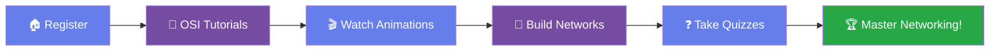

# 🌐 NetDevice Lab: The Interactive Networking Guide

<div align="center">


### *Master Networking Through Interactive Learning*

[](https://www.php.net/)
[](https://developer.mozilla.org/en-US/docs/Web/JavaScript)
[](https://www.mysql.com/)
[](https://html.spec.whatwg.org/)
[](https://www.w3.org/Style/CSS/)

**🎓 Batangas State University | 💻 IT-314 Web Systems Project**

[✨ Features](#-features) • [🚀 Installation](#-installation-guide) • [📖 Documentation](#-usage-guide) • [👥 Team](#-meet-the-team)

---

</div>

## 🎯 What is NetDevice Lab?

NetDevice Lab transforms the traditionally complex world of computer networking into an engaging, visual, and interactive experience. Say goodbye to dense textbooks and hello to:

- 🎬 **Animated Protocol Demonstrations** - Watch data packets travel in real-time
- 🎨 **Visual Topology Design** - Build networks like playing with digital LEGO
- 📚 **Gamified Learning** - Progress through levels, earn badges, conquer quizzes
- 🖥️ **Device Encyclopedia** - Your networking hardware Wikipedia

<div align="center">

</div>

---

## ✨ Features That Make Learning Fun

<table>
  <tr>
    <td width="50%" valign="top">
      
### 🔐 **Smart Authentication**
```
✓ Secure login with bcrypt encryption
✓ "Remember Me" for convenience
✓ Session persistence
✓ Progress auto-save
```

### 🎬 **Protocol Animations**
Watch networking magic happen:
- **TCP Handshake** - See the famous SYN, SYN-ACK, ACK dance
- **DNS Resolution** - From google.com to 142.250.185.46
- **DHCP Process** - The DORA adventure (Discover, Offer, Request, Acknowledge)
- **ICMP Ping** - Echo requests bouncing across networks

    </td>
    <td width="50%" valign="top">

### 📊 **Personal Dashboard**
Your networking command center:
```
📈 Quiz Performance Analytics
⏱️ Study Time Tracking
📝 Recent Activity Feed
🎯 Learning Recommendations
```

### 🎨 **Network Topology Designer**
Build like Cisco Packet Tracer:
- Drag & drop devices
- Connect with virtual cables
- Set IP addresses
- Check connectivity
- Save/Load designs
- Export as image

    </td>
  </tr>
</table>

---

## 📚 Complete Learning Path

<div align="center">



</div>

### 🗺️ **OSI Model Journey** - All 7 Layers Explained

| Layer | Name | What You'll Learn | Icon |
|-------|------|-------------------|------|
| 7️⃣ | Application | HTTP, DNS, FTP magic | 📱 |
| 6️⃣ | Presentation | Encryption & data formatting | 🔐 |
| 5️⃣ | Session | Connection management | 🔗 |
| 4️⃣ | Transport | TCP vs UDP showdown | 🚚 |
| 3️⃣ | Network | IP addressing & routing | 🗺️ |
| 2️⃣ | Data Link | MAC addresses & switches | 🔗 |
| 1️⃣ | Physical | Cables, signals, bits | ⚡ |

### 🎮 **Quiz System** - Test Your Skills

<table>
  <tr>
    <td align="center"><b>😊 Easy</b><br/>Perfect for beginners</td>
    <td align="center"><b>🤔 Medium</b><br/>Challenge yourself</td>
    <td align="center"><b>🔥 Hard</b><br/>Expert level</td>
  </tr>
</table>

**Categories:**
- 🏗️ OSI Model (7 layers of knowledge)
- 🖥️ Network Devices (Routers, switches, oh my!)
- 🔗 Protocols (TCP, DNS, DHCP, and friends)
- 🌐 IP Addressing (Subnetting made simple)
- 🔧 Troubleshooting (Become a network detective)

---

## 🚀 Installation Guide

<div align="center">

</div>

### 📋 Prerequisites Checklist

```bash
☐ XAMPP (Apache + MySQL + PHP 7.4+)
☐ Web Browser (Chrome/Firefox/Edge)
☐ VS Code (optional but recommended)
```

---

### 🎬 Step-by-Step Installation

<details>
<summary><b>🔽 Step 1: Install XAMPP</b></summary>

1. Download XAMPP from [apachefriends.org](https://www.apachefriends.org/)
2. Run the installer
3. Default path is perfect: `C:\xampp\`
4. Install all components

**✅ Success:** You'll see the XAMPP Control Panel

</details>

<details>
<summary><b>🔽 Step 2: Get the Project</b></summary>

**Option A: Git Clone (Recommended)**
```bash
cd C:\xampp\htdocs
git clone <your-repo-url> netdevice-lab
```

**Option B: Manual Download**
```bash
1. Download ZIP from GitHub
2. Extract to: C:\xampp\htdocs\netdevice-lab
3. Ensure folder structure is correct
```

**✅ Success:** You should see all project files in `htdocs/netdevice-lab/`

</details>

<details open>
<summary><b>🔽 Step 3: Database Setup (IMPORTANT!)</b></summary>

1. **Start XAMPP:**
   ```
   Open XAMPP Control Panel
   Click "Start" for Apache ✓
   Click "Start" for MySQL ✓
   ```

2. **Create Database:**
   ```
   → Open browser
   → Go to: http://localhost/phpmyadmin
   → Click "New" in sidebar
   → Database name: netdevice_db
   → Collation: utf8mb4_general_ci
   → Click "Create" 🎉
   ```

3. **Import Data:**
   ```
   → Click on "netdevice_db" database
   → Click "Import" tab
   → Choose file: netdevice_db (1).sql
   → Scroll down, click "Go"
   → Wait for success message ✓
   ```

**✅ Success Message:** "Import has been successfully finished"

</details>

<details>
<summary><b>🔽 Step 4: Verify Configuration</b></summary>

Open `php/config.php` and verify:

```php
<?php
define('DB_SERVER', 'localhost');   // ✓ Default XAMPP
define('DB_USERNAME', 'root');      // ✓ Default XAMPP
define('DB_PASSWORD', '');          // ✓ Empty for XAMPP
define('DB_NAME', 'netdevice_db');  // ✓ Your database name
?>
```

**⚠️ Note:** Only change these if you configured XAMPP differently!

</details>

<details>
<summary><b>🔽 Step 5: Launch the Application</b></summary>

1. **Ensure services are running:**
   ```
   XAMPP Control Panel:
   ✅ Apache - Running (green)
   ✅ MySQL - Running (green)
   ```

2. **Open in browser:**
   ```
   http://localhost/netdevice-lab/
   ```

3. **You should see:**
   - Beautiful homepage with animated globe 🌐
   - "Get Started Free" button
   - Feature showcase

**✅ Success:** Welcome to NetDevice Lab!

</details>

<details>
<summary><b>🔽 Step 6: Create Your First Account</b></summary>

1. Click **"Get Started Free"** or **"Register"**
2. Fill in the form:
   ```
   Full Name: Your Name
   Username: coolnetworker (letters, numbers, _ only)
   Email: you@example.com
   Password: ******* (min 6 characters)
   ```
3. Check "I agree to Terms and Conditions"
4. Click **"Register"**
5. Login with your new credentials
6. Start learning! 🎓

</details>

---

### 🎨 Development Setup (For Developers)

<details>
<summary><b>Setting up VS Code (Optional)</b></summary>

1. **Install VS Code** from [code.visualstudio.com](https://code.visualstudio.com/)

2. **Recommended Extensions:**
   ```
   - PHP Intelephense
   - MySQL (by Jun Han)
   - Live Server
   - Prettier - Code formatter
   - JavaScript (ES6) code snippets
   ```

3. **Open Project:**
   ```bash
   File → Open Folder → C:\xampp\htdocs\netdevice-lab
   ```

4. **Configure Live Server:**
   - Settings → Search "Live Server"
   - Set root: `/htdocs/netdevice-lab`
   - Port: 5500

</details>

---

## 📁 Project Architecture

```
netdevice-lab/
│
├── 🎨 css/
│   ├── style.css           ← Global styles & layouts
│   ├── animations.css      ← Protocol animation magic
│   └── responsive.css      ← Mobile-first responsive design
│
├── ⚡ js/
│   ├── main.js             ← Core functions & utilities
│   └── topology-designer.js ← Canvas-based network builder
│
├── 🔧 php/
│   ├── config.php          ← Database connection (⚠️ Important!)
│   ├── register.php        ← User registration handler
│   ├── login.php           ← Authentication logic
│   ├── check_session.php   ← Session validator
│   ├── get_stats.php       ← Dashboard statistics
│   ├── get_quiz_questions.php ← Quiz question loader
│   ├── save_quiz_result.php   ← Score saver
│   ├── save_topology.php   ← Network design saver
│   ├── load_topology.php   ← Network design loader
│   ├── get_tutorial_progress.php ← Tutorial tracker
│   └── mark_tutorial_complete.php ← Tutorial completer
│
├── 📄 pages/
│   ├── dashboard.html      ← User command center
│   ├── learning.html       ← Learning hub
│   ├── protocols.html      ← Animated protocols
│   ├── tutorials.html      ← OSI layer lessons
│   ├── devices.html        ← Device encyclopedia
│   ├── topology.html       ← Network designer
│   └── quiz.html           ← Quiz system
│
├── 🏠 Root Files
│   ├── index.html          ← Landing page (Start here!)
│   ├── login.html          ← Login page
│   ├── register.html       ← Registration page
│   └── netdevice_db (1).sql ← Database schema (Import this!)
│
└── 📚 Documentation
    └── README.md           ← You are here!
```

---

## 👥 Meet the Team

<div align="center">

### 🌟 The Dream Team Behind NetDevice Lab

<table>
  <tr>
    <td align="center">
      
      <br />
      <sub><b>Kyle M. Banaag</b></sub>
      <br />
      <sub>🎨 Frontend Developer</sub>
    </td>
    <td align="center">
      
      <br />
      <sub><b>Bjorn Phillipe Lara</b></sub>
      <br />
      <sub>⚙️ Backend Developer</sub>
    </td>
    <td align="center">
      
      <br />
      <sub><b>Paolo Q. Dolor</b></sub>
      <br />
      <sub>🗄️ Database Architect</sub>
    </td>
  </tr>
  <tr>
    <td align="center">
      
      <br />
      <sub><b>Von Ian Chris M. Lozano</b></sub>
      <br />
      <sub>🎯 UI/UX Designer</sub>
    </td>
    <td align="center">
      
      <br />
      <sub><b>Ronel Angelo P. Sales</b></sub>
      <br />
      <sub>📊 Project Manager</sub>
    </td>
    <td align="center">
      
      <br />
      <sub><b>BatStateU</b></sub>
      <br />
      <sub>🏛️ Our University</sub>
    </td>
  </tr>
</table>

---


</div>
